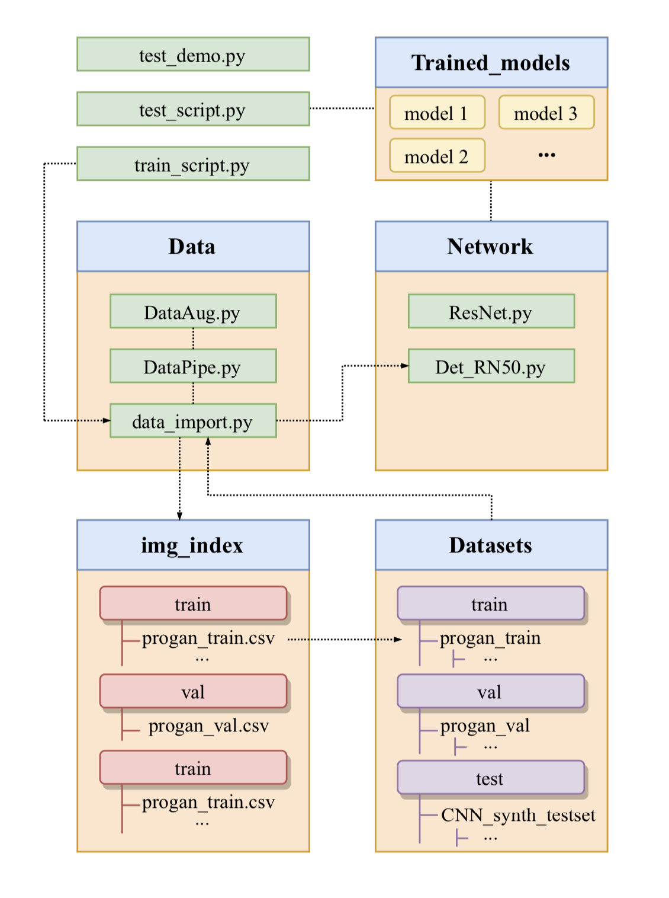

## CNNDetection - TensorFlow 2.2 Version [[Original paper]](https://openaccess.thecvf.com/content_CVPR_2020/html/Wang_CNN-Generated_Images_Are_Surprisingly_Easy_to_Spot..._for_Now_CVPR_2020_paper.html)

## - General structure of our code



## (1) Environment Setup

### Create a conda virtual environment

-  `conda create -n CNNDET-TF python=3.7`

### Install all required packages

- `pip install -r requirements.txt`

## (2) Dataset Preparation

### Demo training set

We picked out one class from the entire 20-class training set, it is provided [here](https://drive.google.com/drive/folders/1HEUGhMrEuhA0Q-ncP3zaAqssF0V0V8b2?usp=sharing).

**Note:** This is a very small training set we held-out from the whole training set only for code verification and demonstration purpose. It do works but won't gaurantee a rather accurate model.

### Training set

We used the same training set as in the original paper, it is provided [here](https://drive.google.com/file/d/1iVNBV0glknyTYGA9bCxT_d0CVTOgGcKh/view?usp=sharing) .

All images in the training set are from LSUN or generated by ProGAN, and they are pre-separated in 20 object categories. For every category, the so-named `0_real` sub-folder contains real-world images, while network-generated images are in the `1_fake` sub-folder.

**Note:** We do provide a easier way to download them into cloud service utilizing [gdown](https://pypi.org/project/gdown/), please refer to  [training-data-download-script.ipynb](Notebooks/training-data-download-script.ipynb) for more information.

### Validation set

Same to the original paper, where a certain amount of ProGAN generated real and fake images were taken out as validation set, we used the validation set to monitor our training process. The validation set can be downloaded [here](https://drive.google.com/file/d/1FU7xF8Wl_F8b0tgL0529qg2nZ_RpdVNL/view?usp=sharing). The directory structure follows the same rule as training set.  

### Test set 

All testsets used in our report can be downloaded [here](https://drive.google.com/file/d/1z_fD3UKgWQyOTZIBbYSaQ-hz4AzUrLC1/view?usp=sharing).

Our whole test set contains images generated from 13 image generative models, including images from 11 models that were tested in the original paper, as well as images from 2 extra sources([StyleGAN2](https://github.com/NVlabs/stylegan2), [whichfaceisreal](https://www.whichfaceisreal.com/)). Images of different generative models are stored in different directories, named after the exact model. Similar as above, real-world images are in `0_real` sub-folder and synthetic images are in `1_fake` sub-folder.

For sources that contains multiple classes like ProGAN, images from different classes are organized in separate subdirectories similar to training set.

## (3) Model training
1. To demonstrate/experiment with the training code, you can download the [demo tranining set](https://drive.google.com/drive/folders/1HEUGhMrEuhA0Q-ncP3zaAqssF0V0V8b2?usp=sharing) for a less time-consuming implementation.
2. To start a actual model training, please download the whole [training set](https://drive.google.com/file/d/1iVNBV0glknyTYGA9bCxT_d0CVTOgGcKh/view?usp=sharing), validation set is optional.

Here we provide the code instruction for model training:
```
python train_script.py [Arguments] 
```
Available Arguments:

```--train_dir``` Path to set directory (default to `../Copy_of_progan_train/train/`)

```--val_dir``` Path to validation set directory (default to `../progan_val/`)

```--train_index``` Path to training set index csv file (default to `Img_index/train/progan_train.csv`)

```--val_index``` Path to validation set index csv file. Put 'None' to train without validation. (default to `Img_index/val/progan_val.csv`)

```--save_path``` Path to save model. Model will be saved as `save_path-cp-{epoch:d}.ckpt`

```--checkpoint``` Path to the checkpoint to restore model (default to `None`)

```--start_epoch``` The starting epoch of training (default to 0)

```--epoch``` Number of epochs to train the model (default to 30)

```--batch_size``` Number of samples per batch (default to 64)

```--blur_prob``` The probability to apply random Gaussian blur on images (default to 0)

```--jpeg_prob``` The probability to apply random JPEG compression on images (default to 0)

## (4) Model Evaluation

### Download our pre-trained models:

In links of each model name you can find every trained model we used to get our test results in the report. Please refer to the table below. 

| Model name                                                   | Trained on       | Train-time Data Augmentation |
| :----------------------------------------------------------- | :--------------- | ---------------------------- |
| [Model-2-class](https://drive.google.com/drive/folders/1n1mcXl_1lJTKK-FV3blK38Z2M_An7Wtd?usp=sharing) | 2-class Pro-GAN  | Blur: 0.5         JPEG: 0.5  |
| [Model-8-class](https://drive.google.com/drive/folders/11D3K8ZSi8XTmBX2weBZDmUONm6RuQetn?usp=sharing) | 8-class Pro-GAN  | Blur: 0.5         JPEG: 0.5  |
| [Model1](https://drive.google.com/drive/folders/1tVS-0Y7ATZg1wp73K_33gkPEBa0xEzfe?usp=sharing) | 20-class Pro-GAN | Blur: N/A        JPEG: N/A   |
| [Model2](https://drive.google.com/drive/folders/10OJ_336HLpYKJxiTyGrXZpFtZMb7FLnG?usp=sharing) | 20-class Pro-GAN | Blur: 0.5         JPEG: N/A  |
| [Model3](https://drive.google.com/drive/folders/1lX6GY-bD35OQzocLjd0kNYz_1gPzcJOH?usp=sharing) | 20-class Pro-GAN | Blur: N/A        JPEG: 0.5   |
| [Model4](https://drive.google.com/drive/folders/1Ux-5bynjckiRdZpfePsMbfHKhpAwceJ4?usp=sharing) | 20-class Pro-GAN | Blur: 0.5         JPEG: 0.5  |
| [Model5](https://drive.google.com/drive/folders/1uE4enOLz2J3ceQVoV9CpUdl23uptuz_c?usp=sharing) | 20-class Pro-GAN | Blur: 0.1         JPEG: 0.1  |

### Quick test

Here we provide the code sample for running tests on our demo images. 

```bash
python test_demo.py --model ./trained_model/model1/baseline-cp-8.ckpt --image ./demo_images/real.png
```

**Note:** Since demo images are contained in this repo, you don't need to download any [test set](https://drive.google.com/file/d/1z_fD3UKgWQyOTZIBbYSaQ-hz4AzUrLC1/view?usp=sharing) for quick test, getting at least one model from above is enough.

### Full test

To  completely repeat tests in our report, you will need to download the whole [test set](https://drive.google.com/file/d/1z_fD3UKgWQyOTZIBbYSaQ-hz4AzUrLC1/view?usp=sharing).

We also provide all of raw outputs (values straight out of sigmoid) from our model in every test, for accuracy and average precision (AP) score inspection and comparison, you can find them in [test _results](test_results/) folder. As for score calculation, we put the code we use in [main.ipynb](main.ipynb).

For full test instructions, please refer to  [main.ipynb](main.ipynb) as well.

## File organization of this repo.
```
├── E4040.2020Fall.ACNN.report.jl5742.bf2477.zy2431.pdf
├── Data
│   ├── DataAug.py
│   ├── DataPipe.py
│   └── data_import.py
├── Img_index
│   ├── test
│   │   ├── biggan_test.csv
│   │   ├── crn_test.csv
│   │   ├── cyclegan_test.csv
│   │   ├── deepfake_test.csv
│   │   ├── gaugan_test.csv
│   │   ├── imle_test.csv
│   │   ├── progan_test.csv
│   │   ├── san_test.csv
│   │   ├── seeingdark_test.csv
│   │   ├── stargan_test.csv
│   │   ├── stylegan2_test.csv
│   │   ├── stylegan_test.csv
│   │   └── whichfaceisreal_test.csv
│   ├── train
│   │   ├── 1class.csv
│   │   ├── 2class.csv
│   │   ├── 8class.csv
│   │   └── progan_train.csv
│   └── val
│       └── progan_val.csv
├── LICENSE
├── Network
│   ├── Det_RN50.py
│   └── ResNet.py
├── Notebooks
│   ├── 2-8-classes.ipynb
│   ├── Code_Snippets.ipynb
│   ├── Cross_dataset_comp.ipynb
│   ├── DataLoaderTest.ipynb
│   ├── Data_preprocessing.ipynb
│   ├── IMG_9686.jpg
│   ├── PlayGround.ipynb
│   ├── aug_comp.jpg
│   ├── div_comp.jpg
│   └── training-data-download-script.ipynb
├── README.md
├── demo_images
│   ├── fake.png
│   └── real.png
├── main.ipynb
├── requirements.txt
├── test_demo.py
├── test_results
│   ├── model-2c
│   │   ├── biggan.csv
│   │   ├── crn.csv
│   │   ├── cyclegan.csv
│   │   ├── deepfake.csv
│   │   ├── gaugan.csv
│   │   ├── imle.csv
│   │   ├── progan.csv
│   │   ├── san.csv
│   │   ├── seeingdark.csv
│   │   ├── stargan.csv
│   │   ├── stylegan.csv
│   │   ├── stylegan2.csv
│   │   └── whichfaceisreal.csv
│   ├── model-8c
│   │   ├── biggan.csv
│   │   ├── crn.csv
│   │   ├── cyclegan.csv
│   │   ├── deepfake.csv
│   │   ├── gaugan.csv
│   │   ├── imle.csv
│   │   ├── progan.csv
│   │   ├── san.csv
│   │   ├── seeingdark.csv
│   │   ├── stargan.csv
│   │   ├── stylegan.csv
│   │   ├── stylegan2.csv
│   │   └── whichfaceisreal.csv
│   ├── model1
│   │   ├── biggan.csv
│   │   ├── crn.csv
│   │   ├── cyclegan.csv
│   │   ├── deepfake.csv
│   │   ├── gaugan.csv
│   │   ├── imle.csv
│   │   ├── progan.csv
│   │   ├── san.csv
│   │   ├── seeingdark.csv
│   │   ├── stargan.csv
│   │   ├── stylegan.csv
│   │   ├── stylegan2.csv
│   │   └── whichfaceisreal.csv
│   ├── model2
│   │   ├── biggan.csv
│   │   ├── crn.csv
│   │   ├── cyclegan.csv
│   │   ├── deepfake.csv
│   │   ├── gaugan.csv
│   │   ├── imle.csv
│   │   ├── progan.csv
│   │   ├── san.csv
│   │   ├── seeingdark.csv
│   │   ├── stargan.csv
│   │   ├── stylegan.csv
│   │   ├── stylegan2.csv
│   │   └── whichfaceisreal.csv
│   ├── model3
│   │   ├── biggan.csv
│   │   ├── crn.csv
│   │   ├── cyclegan.csv
│   │   ├── deepfake.csv
│   │   ├── gaugan.csv
│   │   ├── imle.csv
│   │   ├── progan.csv
│   │   ├── san.csv
│   │   ├── seeingdark.csv
│   │   ├── stargan.csv
│   │   ├── stylegan.csv
│   │   ├── stylegan2.csv
│   │   └── whichfaceisreal.csv
│   ├── model4
│   │   ├── biggan.csv
│   │   ├── crn.csv
│   │   ├── cyclegan.csv
│   │   ├── deepfake.csv
│   │   ├── gaugan.csv
│   │   ├── imle.csv
│   │   ├── progan.csv
│   │   ├── san.csv
│   │   ├── seeingdark.csv
│   │   ├── stargan.csv
│   │   ├── stylegan.csv
│   │   ├── stylegan2.csv
│   │   └── whichfaceisreal.csv
│   └── model5
│       ├── biggan.csv
│       ├── crn.csv
│       ├── cyclegan.csv
│       ├── deepfake.csv
│       ├── gaugan.csv
│       ├── imle.csv
│       ├── progan.csv
│       ├── san.csv
│       ├── seeingdark.csv
│       ├── stargan.csv
│       ├── stylegan.csv
│       ├── stylegan2.csv
│       └── whichfaceisreal.csv
├── test_script.py
└── train_script.py

```
